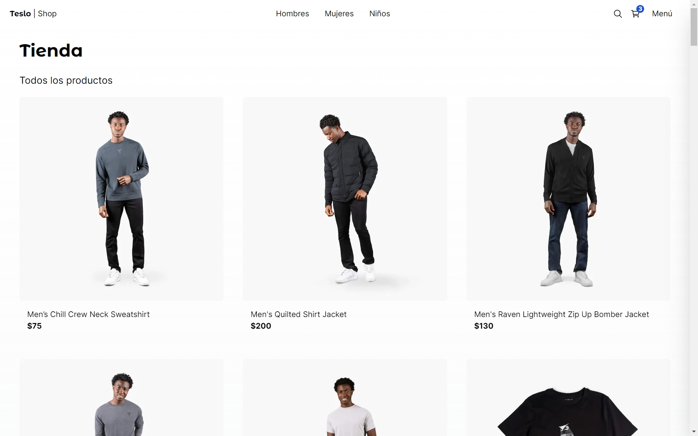
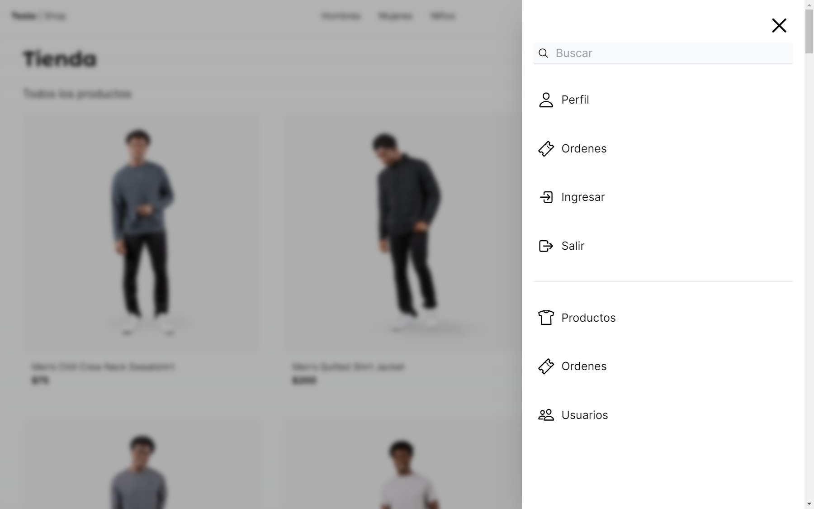
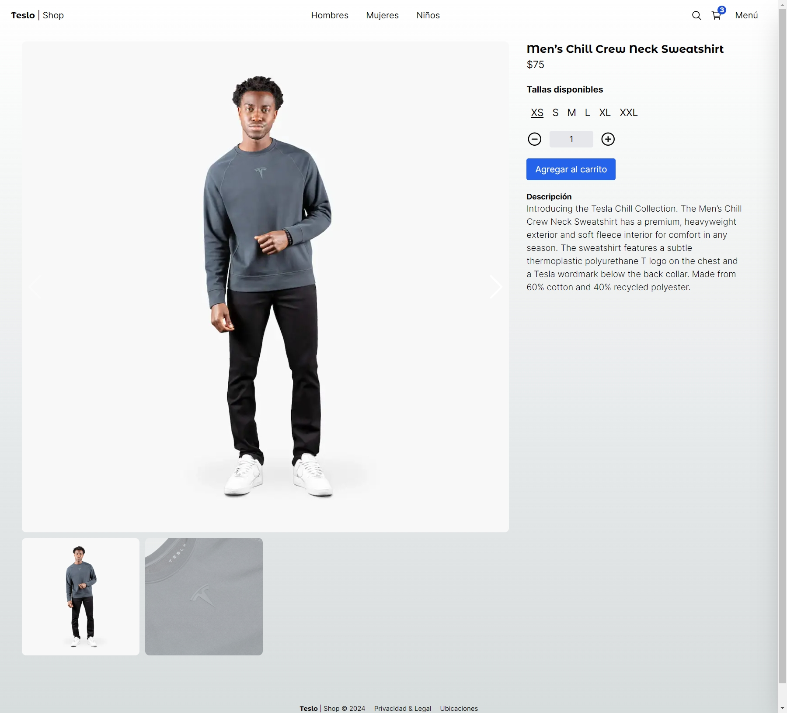
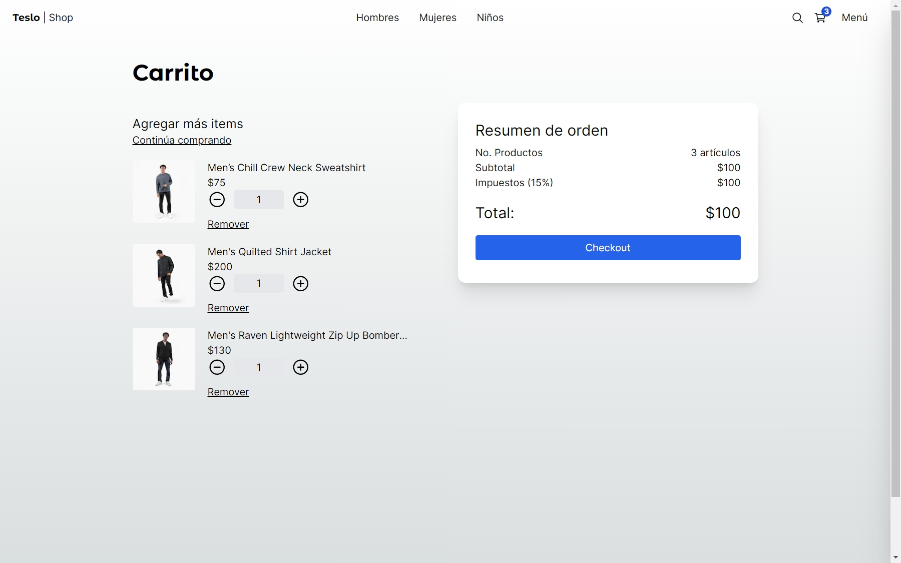
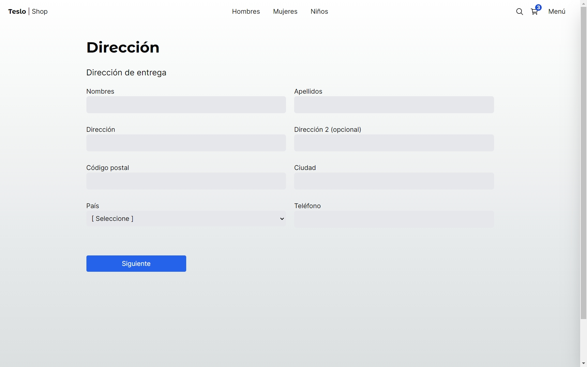
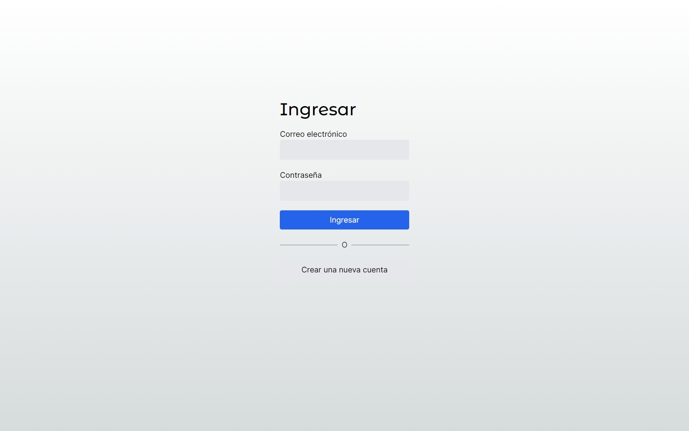
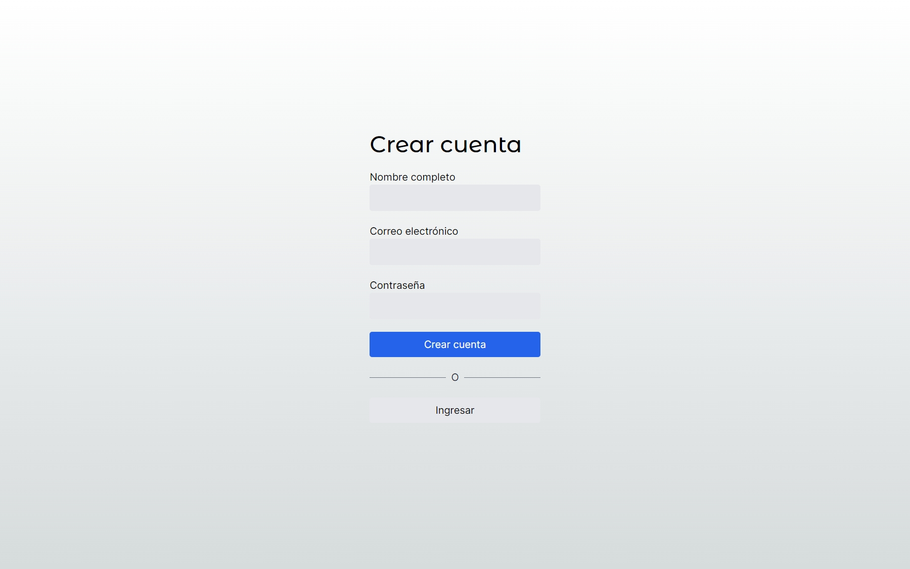

# Descripción

E-Commerce inspirado en Tesla-Shop es una plataforma de comercio electrónico que ofrece una amplia gama de productos relacionados con la marca Tesla, como vehículos eléctricos, accesorios, ropa y otros artículos. El sitio web está desarrollado utilizando tecnologías modernas y de vanguardia para brindar una experiencia de usuario excepcional.

### 🛠️ Tecnologías utilizadas:

- Bcryptjs (Encriptador)
- CLSX (Paquete que permite hacer condicionales con las clases de Tailwind)
- Docker (Imagen de la base de datos)
- Next-Auth (Autenticación)
- Next.js
- PostgreSQL
- Prisma ORM
- React Hook Form
- React icons
- Swiper (Slider)
- Tailwind
- TS-Node
- TypeScript
- Zod
- Zustand

## 🚀 Correr en DEV

1. Clonar el repositorio.
2. Crear una copia del ```.env.template``` y renombrarlo a ```.env``` y cambiar las variables de entorno.
3. Instalar dependencias ```npm install```
4. Levantar la base de datos ```docker-compose up -d```
5. Correr las migraciones de Prisma ```npx prisma migrate dev```
6. Ejecutar el seed ```npm run seed```
7. Limpiar el localStorage del navegador.
8. Correr el proyecto ```npm run dev```


# Imágenes del proyecto

### Página de Inicio


### Página de Inicio con el Sidebar abierto


### Página de producto


### Página del carrito


### Página de dirección del cliente


### Página del Login


### Página para crear cuenta
